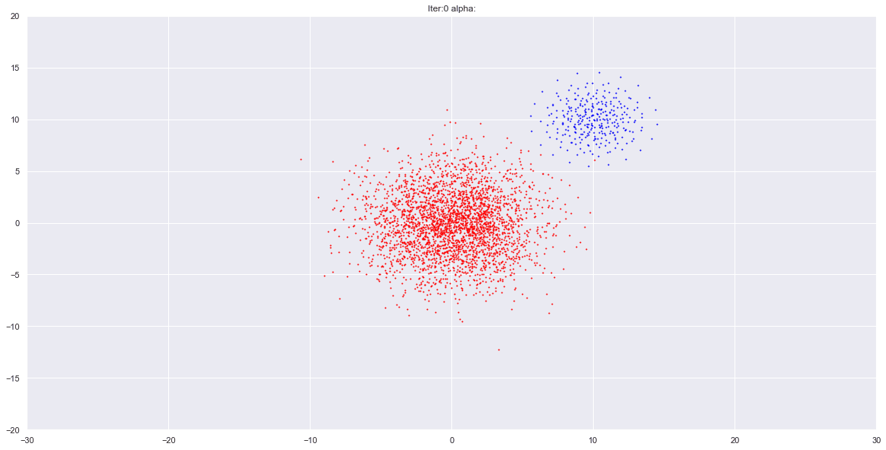
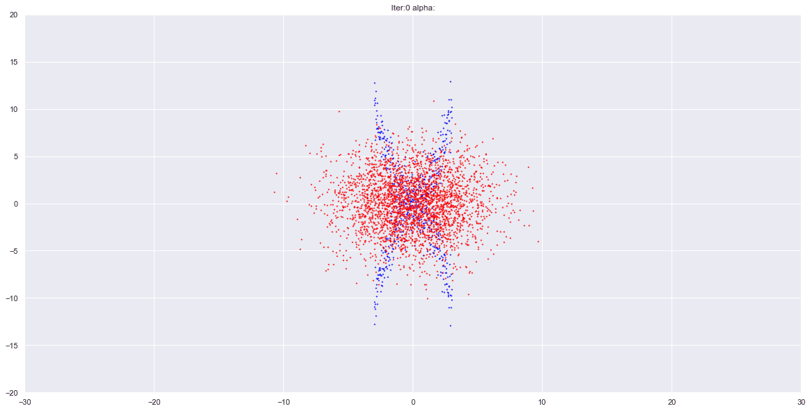
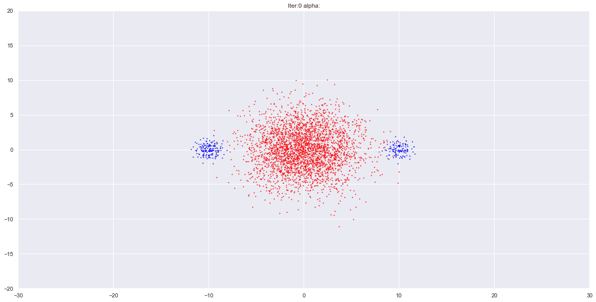

# Implementation of Amortized Stien Variational Gradient Descent 

Based on the paper : [Learning to draw samples: with application to amortized maximum likelihood estimator for generative adversarial learning](https://arxiv.org/abs/1611.01722)

I believe this is the only new Implementation of Amortized SVGD in Pytorch since the old version from 5 years ago using Chainer framework [Chainer Implementation](https://github.com/musyoku/ddgm)

## here are some examples :

- This one works Perfectly

- This one not very well

- And this one doesn't work at all

### this is as far as i've got, so if anyone would be interested to help, you're all welcome
