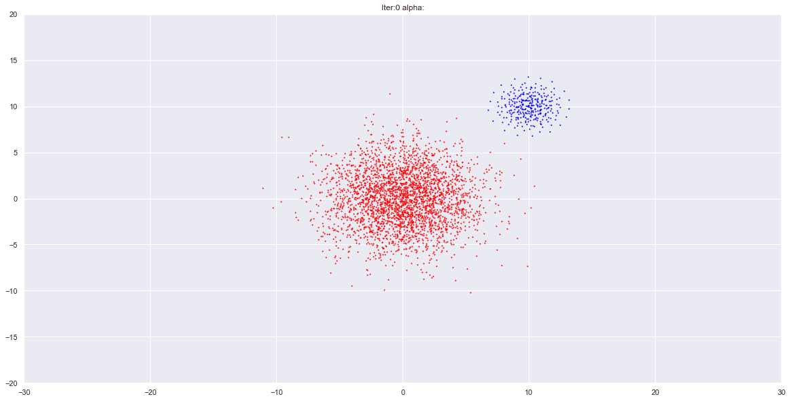
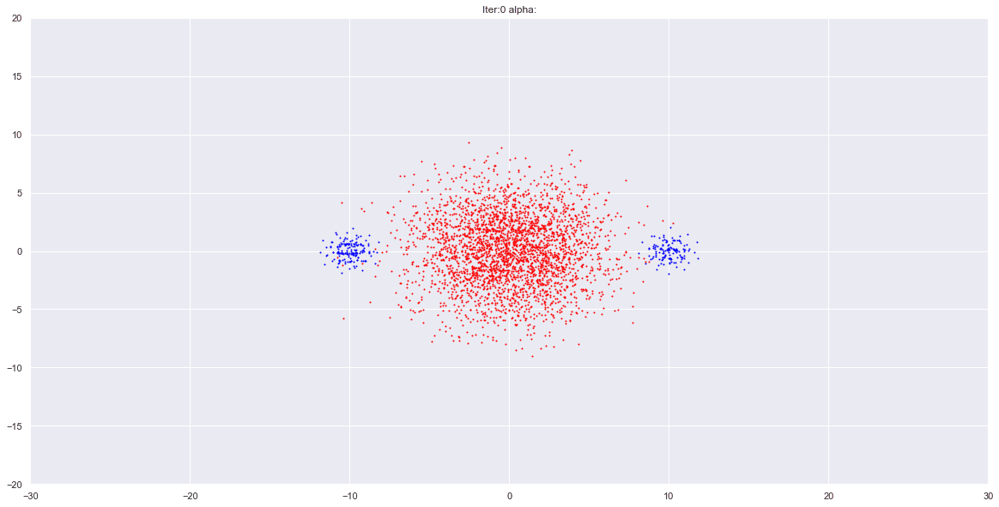
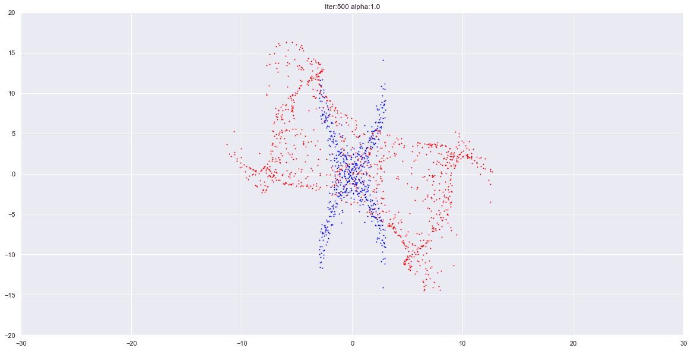

# Implementation of Amortized Stien Variational Gradient Descent 

Based on the paper : [Learning to draw samples: with application to amortized maximum likelihood estimator for generative adversarial learning](https://arxiv.org/abs/1611.01722)

## here are some examples :

### If Anyone is interested in contributing or collaborating, I would be very glad for that. Thank you
